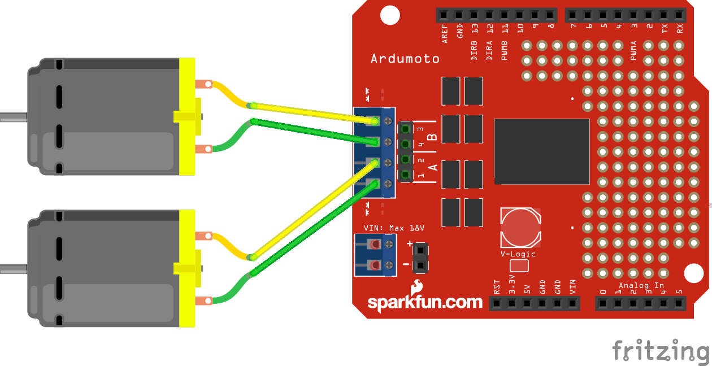

# test-motors
Use the files included in this folder to test your Ardumoto shield and your motors.

## Hookup Guide
[Sparkfun has already created a great hookup guide, click here to view it](https://learn.sparkfun.com/tutorials/ardumoto-kit-hookup-guide)

I have also created a simplified schematic included below.

**NOTE: You can test while the arduino is connected to the Pi-Top but note that the power output to the wheels will be significantly less than when you are connected to the 9V battery!**

### Hookup Schematic

## How to use the code
Once you have connected the arduomoto shield to the arduino and wired everything correctly you are ready to copy the code contained in the test-motors.ino file. This is arduino code that you can load to the arduino and see if the motors are attached and working correctly. You can then use this code as a template for your autonomous challange!