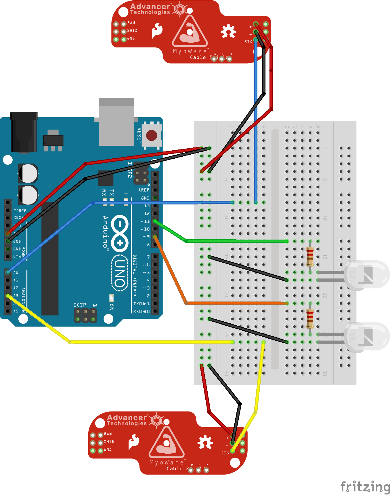

# test-muscle-sensor
Use the files included in this folder to test your muscle sensor placement and make sure that you have the correct "threshold" determined. We need to be able to tell when you activate your muscle (and when you stop activating it) in order to adequately drive your car!

## Hookup Guide
In order to determine your threshold and make sure that your muscle sensors are working, we first need to wire everything up. For this, we are going to wire up 2 LED lights and the muscle sensors to the Arduino. The lights will help give us visual feedback when our threshold has been crossed (equivalent to starting the motors for the muscle car) See the wiring diagram and table below to make sure everything is hooked up appropriately. In order to make the following connections, you must use your breadboard correctly! If you aren't sure, ask.

**NOTE: You should do the testing while the Arduino is connected to the Pi-Top via usb**

### Hookup Schematic

### Hookup Table
| Arduino Pin | What it should be connected to |
|:-----------:|:------------------------------:|
|      5V     | + on both muscle sensors       |
|    GND      | - on both muscle sensors, and - on LED       |
|    A0       | Sig from left muscle sensor    |
|    A3       | Sig from right muscle sensor   |
| Digital 11  | + of left LED (don't forget a pull down resistor!) |
| Digital 9   | + of right LED (don't forget a pull down resistor!) |

## How to use the code
Once you have made the following connections, and have appropriately attached the muscle sensor to your biceps using electrodes, you are ready to copy the code contained in the test-muscle-sensors.ino file. This is arduino code that you can load to the arduino and see if the muscle sensors are working, and to set the threshold to an appropriate level so that you can adequately control the car.